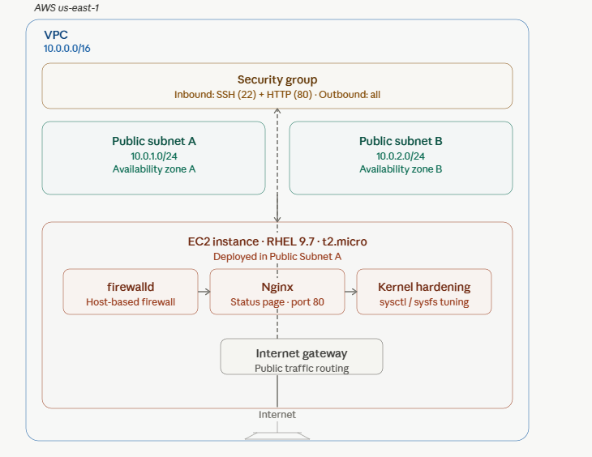
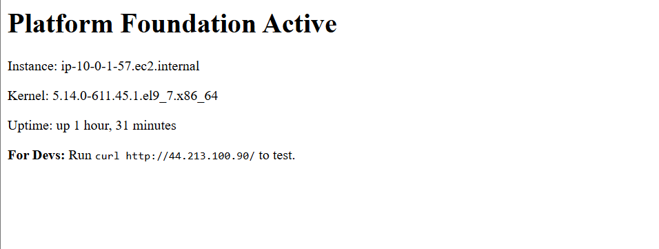

# Platform Automation Foundation

Production-hardened RHEL 9 on AWS using Terraform and Ansible.

## Architecture



## Live Demo



## Skills Demonstrated
- Infrastructure as Code (Terraform)
- Configuration Management (Ansible)
- Enterprise Linux (RHEL 9.7)
- Security Hardening (firewalld, kernel tuning)
- AWS Networking (VPC, subnets, security groups)
- Monitoring Tools (htop, tcpdump, strace)

## Quick Start
```
git clone https://github.com/JoeyAkomeah/platform-automation-foundation.git
cd platform-automation-foundation
make deploy-all
curl http://<public-ip>/
make destroy
```

## Author
Joey Akomeah - Platform & DevOps Engineer